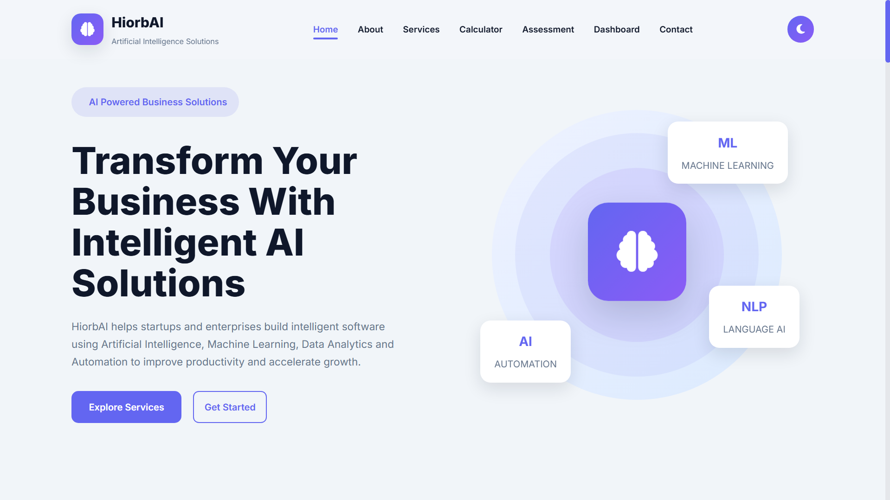
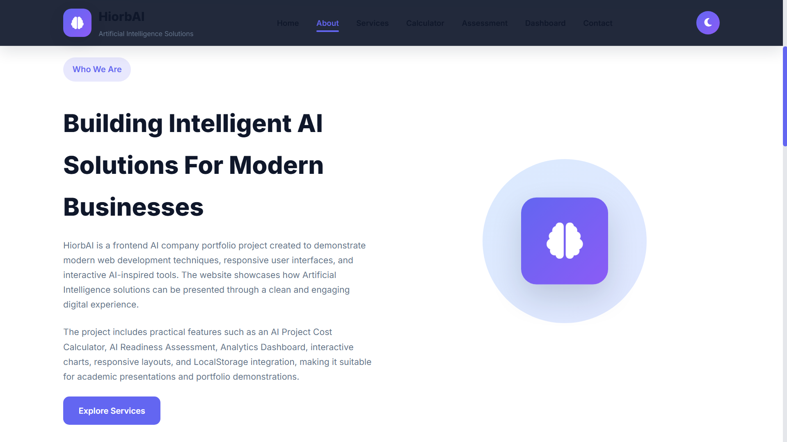
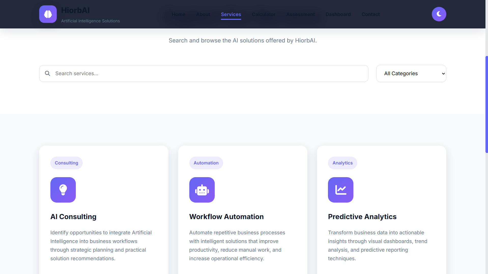
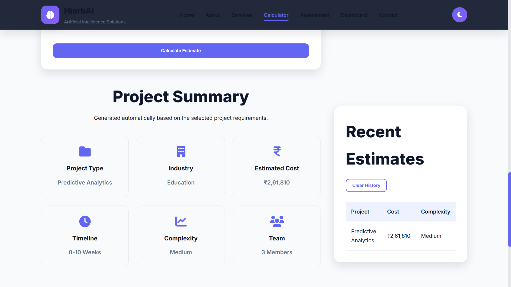
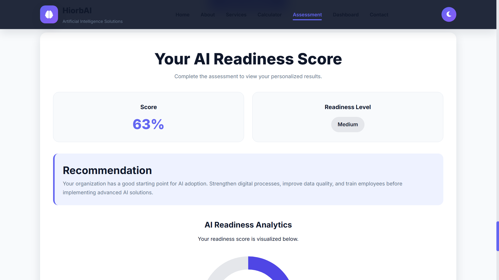
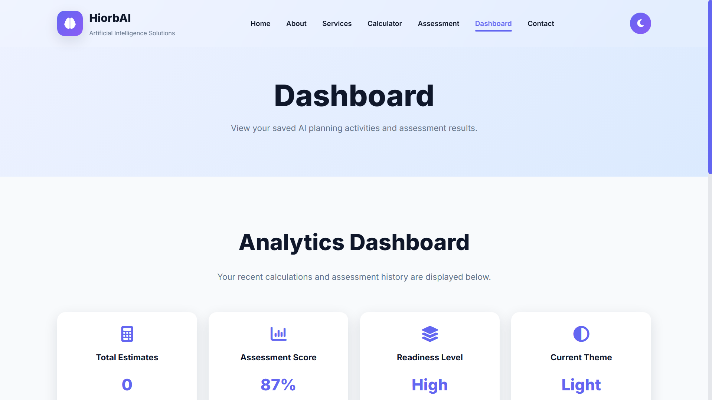
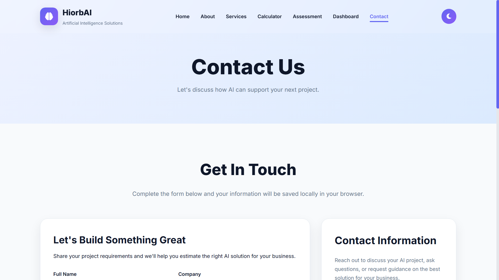

# HiorbAI

A modern frontend-only AI company website developed using HTML, CSS, JavaScript, Chart.js, and LocalStorage.

This project was created as part of the Synent Technology Web Development & Design Internship.

---

## Project Overview

HiorbAI is a responsive multi-page AI company website that demonstrates modern frontend web development concepts without using any backend technologies or frameworks.

The project focuses on clean UI design, responsive layouts, reusable components, interactive JavaScript features, browser storage using LocalStorage, and data visualization using Chart.js.

---

## Project Objectives

- Build a responsive multi-page website
- Create reusable UI components
- Implement modern frontend features
- Store user data using LocalStorage
- Visualize data using Chart.js
- Demonstrate clean UI/UX principles
- Maintain reusable and organized code structure

---

## Features

### General Features

- Responsive multi-page website
- Modern SaaS-inspired user interface
- Sticky navigation bar
- Dark and Light theme with LocalStorage
- Scroll progress indicator
- Loading screen
- Scroll-to-top button
- Professional footer
- Reusable navbar and footer components

### Home Page

- Hero section
- AI company introduction
- Services overview
- Call-to-action section
- Animated statistics
- Professional responsive layout

### About Page

- Company overview
- Mission and vision
- Core values
- Technology stack
- Why choose HiorbAI

### Services Page

- AI service cards
- Search functionality
- Category filtering
- Responsive service grid

### AI Project Cost Calculator

- Project estimation form
- Dynamic cost calculation
- Timeline estimation
- Complexity analysis
- Recommended team size
- Project summary
- Calculator history using LocalStorage

### AI Readiness Assessment

- 15 assessment questions
- Automatic score calculation
- Readiness level analysis
- Improvement recommendations
- Chart.js visualization
- Assessment history using LocalStorage

### Analytics Dashboard

- Project statistics
- Assessment analytics
- Calculator statistics
- Interactive charts
- LocalStorage data visualization

### Contact Page

- Inquiry form
- LocalStorage data storage
- Responsive contact layout
- Frontend demonstration notice

---

## Technology Stack

### Frontend

- HTML5
- CSS3
- JavaScript (ES6)

### Libraries

- Chart.js
- Font Awesome
- Google Fonts

### Browser Storage

- LocalStorage

### Development Tools

- Visual Studio Code
- Git
- GitHub

---

## Folder Structure

```
HiorbAI
│
├── components
│   ├── navbar.html
│   └── footer.html
│
├── css
│   └── style.css
│
├── data
│   └── services.json
│
├── images
│
├── js
│   └── script.js
│
├── reports
│   └── Project_Report.md
│
├── screenshots
│
├── about.html
├── assessment.html
├── calculator.html
├── contact.html
├── dashboard.html
├── index.html
├── services.html
├── README.md
└── favicon.ico
```

---

## LocalStorage Usage

The project uses LocalStorage to provide a frontend-only interactive experience.

Stored data includes:

- Theme preference
- Calculator history
- Assessment results
- Dashboard statistics
- Contact inquiries
- User preferences

All information remains inside the user's browser and is never transmitted to a server.

---

## Third-Party Resources

- Chart.js for charts and analytics
- Font Awesome for icons
- Google Fonts (Inter)

---

## Installation

1. Download or clone the repository.

2. Open the project folder in Visual Studio Code.

3. Install the Live Server extension.

4. Right-click on `index.html`.

5. Select **Open with Live Server**.

6. Navigate through the website using the navigation bar.

---

## Project Workflow

The project follows a modular frontend architecture.

1. The user visits the Home page.
2. Navigation is loaded using reusable HTML components.
3. JavaScript initializes the common UI features.
4. User interactions are handled using JavaScript.
5. Data is stored in LocalStorage.
6. Chart.js visualizes assessment and dashboard data.
7. Theme preference is restored automatically on every visit.

---

## Highlights

- Frontend-only implementation
- Responsive design
- Reusable components
- Interactive UI
- LocalStorage integration
- Chart.js analytics
- Modern SaaS-inspired interface
- Clean project structure
- GitHub-ready
- Internship-ready

---

## Future Enhancements

This project can be extended by adding:

- User authentication
- Backend integration
- Database connectivity
- AI chatbot
- Email service integration
- Real-time analytics
- Admin login
- Payment gateway
- Project tracking system
- Cloud deployment

---

## Learning Outcomes

Through this project, the following concepts were implemented and practiced:

- Responsive web design
- Component-based frontend development
- DOM manipulation
- Event handling
- LocalStorage
- Dynamic rendering
- Form validation
- Chart.js integration
- UI/UX design
- Modern JavaScript
- Git and GitHub workflow

---

## Author

**Project Name**

HiorbAI

**Developed By**

Himanshu Chenda

**Internship**

Synent Technology Web Development & Design Internship

---

## License

This project was developed for educational and internship purposes.

---

## Acknowledgements

Special thanks to Synent Technology for providing the internship opportunity and project guidelines that inspired the development of this frontend web application.

---

## Project Status

**Status:** Completed

This project demonstrates a modern frontend AI company website built using HTML, CSS, JavaScript, Chart.js, and LocalStorage. It has been developed as part of the Synent Technology Web Development & Design Internship and showcases responsive design, reusable components, interactive features.

---

# Project Screenshots

## Home



---

## About



---

## Services



---

## AI Project Cost Calculator



---

## AI Readiness Assessment



---

## Analytics Dashboard



---

## Contact

